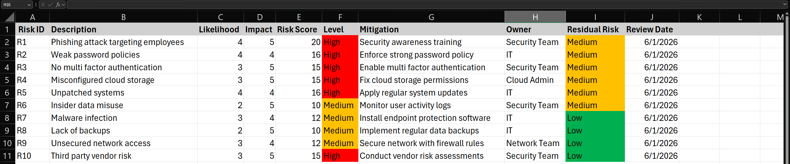

# GRC Risk Register Lab

## Project Overview

In this project, I developed a risk register to identify, assess, and manage common security risks. Using a structured approach, I assigned likelihood and impact scores, calculated risk levels, and defined mitigation strategies. This project demonstrates how organizations prioritize and reduce risk using GRC processes.

## Objective

Create a risk register that identifies security risks, evaluates their impact, and defines mitigation strategies to reduce overall risk exposure.

## Risk Assessment Methodology

Each risk was evaluated using:

- Likelihood score based on probability of occurrence  
- Impact score based on potential business damage  
- Risk score calculated from likelihood and impact  
- Residual risk after mitigation controls  

## Risks Identified

- Phishing attacks  
- Weak password policies  
- Lack of multi factor authentication  
- Misconfigured cloud storage  
- Unpatched systems  
- Insider data misuse  
- Malware infection  
- Lack of backups  
- Unsecured network access  
- Third party vendor risk  

## Mitigation Strategy

For each risk, I defined:

- Preventive controls such as MFA, patching, and access restrictions  
- Detection controls such as logging and monitoring  
- Assigned risk owners responsible for mitigation  
- Review dates to ensure ongoing risk management  

## Key Findings

- High-risk issues included lack of MFA and unpatched systems  
- Many risks can be reduced with basic security controls  
- Regular review and ownership are critical for effective risk management  
- Risk scoring helps prioritize remediation efforts  

## GRC Use Case

### Scenario

An organization needs to identify and manage security risks to reduce the likelihood of incidents and maintain compliance.

### Process

- Identify risks across systems and processes  
- Assess likelihood and impact  
- Prioritize based on risk score  
- Apply mitigation controls  
- Track residual risk and review regularly  

This reflects how organizations manage risk as part of governance, risk, and compliance programs.

## What I Learned

This project showed how risk management is structured in a real environment. I learned how to evaluate risk, assign ownership, and apply mitigation strategies to reduce exposure. This process is essential for maintaining security and supporting compliance requirements.

## Tools Used

- Microsoft Excel  

## Files

- GRC-Risk-Register.xlsx  
- GRC-Risk-Register-Jayden-Williams.pdf  

## Screenshot

